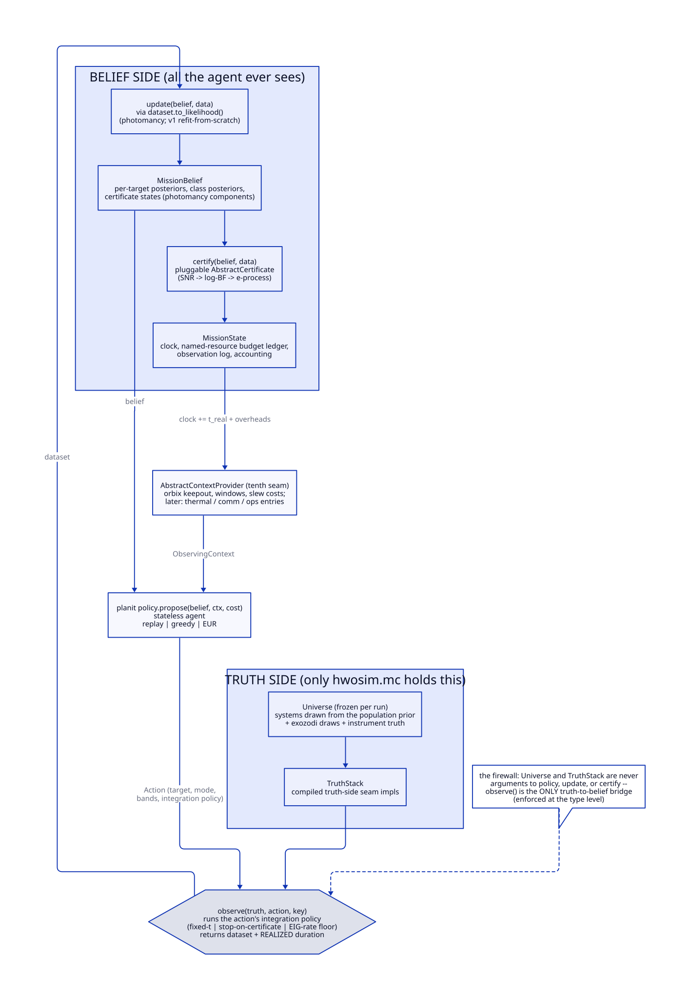
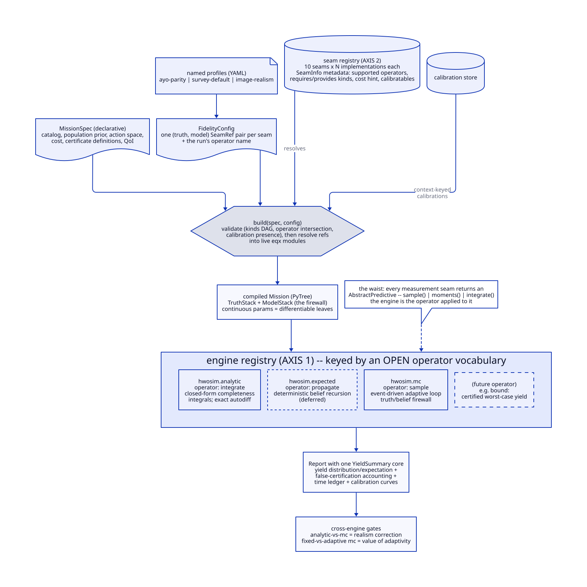

# Architecture

```{note}
hwosim is in the design stage. This page records the architecture the library is
being built toward, so early users and contributors can see where each piece will
land. Interfaces described here will change as the first validation milestones run.
```

## What hwosim is

hwosim is a closed-loop mission simulator and yield calculator for exoplanet
direct-imaging missions, built for the Habitable Worlds Observatory concept. It
plays out a full mission against simulated universes (schedule, observe, update
beliefs, certify detections) and reports certified-yield distributions, time
accounting, and calibration diagnostics.

Classical yield codes such as AYO and EXOSIMS score targets with precomputed
completeness curves and fixed revisit heuristics. hwosim instead carries real
inference in the loop: each target holds a posterior belief that every observation
updates, scheduling policies act on those beliefs, and quantities that classical
codes hardcode (completeness, revisit criteria, characterization time) become
emergent outputs of the simulation.

hwosim owns no physics, no inference, and no policy logic of its own. It is the
composition layer for the HWO simulation suite:

| library | role in hwosim |
| --- | --- |
| skyscapes | astrophysical scenes, target catalogs, population synthesis |
| orbix | orbital propagation, observatory geometry, keepout |
| jaxedith | count rates and integration times |
| coronagraphoto | image-level observation simulation |
| coronachrome | IFS forward model and spectral extraction |
| coronalyze | post-processing and detection statistics |
| photomancy | posteriors, evidence, expected information gain |
| planit-py | scheduling policies and the decision vocabulary |
| yippy / optixstuff / hwoutils | coronagraph performance data, hardware primitives, shared math |



## The environment, the agent, and the belief

The mission loop is a partially observed decision process split across three
libraries. hwosim is the environment: it owns the simulated truth, the clock, the
observation model, and the bookkeeping. planit-py is the agent: a stateless policy
that proposes the next action from the current belief and observing context.
photomancy is the belief update both share.

A strict firewall separates truth from belief. The simulator holds both the drawn
universe and the agent's belief about it, and the only bridge between them is
`observe(truth, action, key) -> data`. The truth container is never an argument to
the policy, the belief update, or the certification layer; the split is enforced at
the type level rather than by convention. Observations expose `to_likelihood()`
factories, so heterogeneous data (detection outcomes, astrometry, spectra, frames)
flow into one belief without hwosim interpreting any physics itself.



## Two configuration axes

A run is configured along two independent axes, and neither is a global fidelity
knob.

### Axis 1: the outcome operator

Every measurement model returns a predictive distribution. What a run does with
that distribution is the operator, and each operator is served by its own execution
engine:

| engine | operator | what it does | differentiable |
| --- | --- | --- | --- |
| `hwosim.analytic` | integrate | closed-form completeness integrals over the population prior (the AYO limit) | exactly, by autodiff |
| `hwosim.expected` | propagate | a deterministic mission in belief space (preposterior analysis) | end to end |
| `hwosim.mc` | sample | the full adaptive Monte Carlo loop against drawn truths | via policy-gradient or paired-seed estimators |

Engines live in a registry keyed by an open operator vocabulary. Three operators
are known today; a genuinely new evaluation semantics (for example certified
worst-case bounds) would enter as a new registry entry rather than a redesign.
Designs are optimized on the differentiable engines and verified on the sampling
engine, and the residual differences between engines are science outputs in their
own right: the gap between the analytic and sampled mission measures the realism
correction, and the gap between fixed and adaptive schedules measures the value of
adaptivity.

### Axis 2: the per-stage implementation registry

Within a run, fidelity is a property of each pipeline stage, not of the run. Every
stage (scene, instrument, observation, post-processing, characterization,
certification, policy, population, observing context, cost) is an abstract
interface with an unordered registry of implementations, and fidelity is metadata
on a registry entry. Three competing high-fidelity post-processing algorithms are
three entries; an external algorithm plugs in as one more entry wrapped in a
composition adapter.

A `FidelityConfig` picks one entry per stage as a (truth, model) pair, defaulting
equal; deliberately mismatching the pair is how model-misspecification studies are
expressed. Named profiles cover the standard configurations, and an ablation
harness runs paired-seed A/B comparisons that differ in exactly one stage, with
realized false-alarm rates equalized across arms before yield deltas are reported.



### Compatibility: typed wiring contracts

Not every combination of stage implementations makes sense: frame-based
post-processing cannot run on a summary-level count-rate observation model.
Compatibility is therefore formalized rather than documented. Each implementation
declares which contract classes it consumes and produces (summary measurements,
image frames, extracted spectra, detection statistics), the stage graph is fixed,
and validation checks every edge by subtyping before anything runs, together with
operator support and calibration availability. A rejected configuration produces a
message that names the incompatible types and the registry entries that would be
compatible, and a compatibility matrix for any pair of stages can be rendered
straight from the registry metadata. Contract tests verify the declared types
against real behavior, so the metadata cannot drift from the code. The belief side
of the loop needs none of this wiring: every dataset exposes a likelihood factory,
so beliefs, policies, and costs are agnostic to the data kind by construction.



## The calibration cascade

Cheap implementations of a stage are calibrated against expensive ones,
automatically. An implementation may declare a distillation edge, meaning it can
re-fit its parameters from the results of a named costlier implementation (for
example: image-level runs re-fit the summary-level astrometric and photometric
error models; frame-based post-processing re-fits analytic throughput factors; full
spectral retrievals re-fit Fisher-summary inflation factors). Whenever an expensive
implementation runs, every downstream surrogate re-fits on the new results. Fitted
parameters are stored together with their residual distributions in a context-keyed
calibration store, so a cheap run carries surrogate uncertainty as inflated error
bars instead of false precision. Paired cheap and expensive runs also enable
multi-fidelity Monte Carlo estimation: the cheap configuration runs on every
universe, the expensive one on a paired subsample, and the combination gives
variance-reduced high-fidelity yield estimates.

## Runs are datasets

Every run writes a directory with a manifest (specification, configuration, seed
root, library versions, precision flags, calibrations consumed), the observation
log, belief snapshots, and the report. Replay reconstructs a run by rebuilding from
the manifest and loading the logged arrays; live objects are never pickled.
Random-number streams are keyed by (target, epoch, purpose) rather than by call
order, which keeps paired ablation arms aligned even after adaptive trajectories
diverge.

## Validation

The first milestone is parity: with a replayed schedule and inference off, hwosim
must reproduce AYO/EXOSIMS-style expected yields under matched detection models and
matched overhead bookkeeping. Cross-engine consistency checks (the sampling
engine's ensemble mean against the analytic engine; fixed-schedule sampling runs
against the belief-space engine) then become permanent regression tests. Image-level
re-simulation of selected events calibrates the summary-level error models.

## Extending hwosim

Adding a capability is meant to be a bounded, local change:

1. A new algorithm for an existing stage: implement the stage's abstract class (or
   wrap external code in a composition adapter), register it with metadata
   (supported operators, consumed and produced contract types, cost, calibratable
   parameters), and instantiate the stage's contract-test suite.
2. A heavyweight dependency: add it behind an optional extra, with its adapter
   module importing lazily.
3. A genuinely new stage or operator: a deliberate API event with its own abstract
   class or engine, which the registries absorb without redesign.
